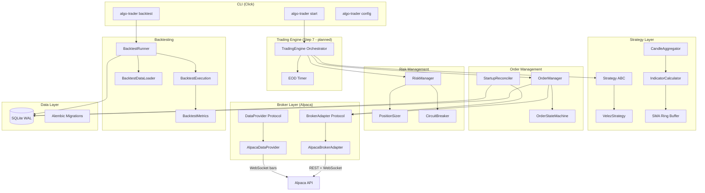

# Algo Trader

An algorithmic trading system for US equities that performs technical analysis on real-time market data, detects trading signals, and executes trades automatically via brokerage APIs.

## Overview

Algo Trader is a production-grade automated trading platform that combines deterministic technical analysis strategies with AI-powered advisory analysis. The system monitors positions in real-time, manages risk automatically, and provides CLI tools for backtesting and live trading.

The core philosophy: **AI advises, the strategy engine decides.** AI agents provide analysis, confidence scores, and commentary as inputs to a deterministic strategy engine. The strategy engine always makes the final call. Same strategy code runs identically in backtest, paper, and live modes (Jesse-inspired architecture).

Paper trading is the default. Live trading requires an explicit environment variable opt-in. Real money is at stake — every component is designed with safety, crash recovery, and broker reconciliation in mind.

## Architecture



## Planned Features

### Phase 1 — Trading Engine + CLI (in progress)

| Step | Component | Status |
|------|-----------|--------|
| 1 | Foundation scaffolding (config, DB, migrations) | Done |
| 2 | Broker abstraction + Alpaca adapter (REST + WebSocket) | Done |
| 3 | Strategy engine + Velez SMA convergence strategy | Done |
| 4 | Order management + risk management (position sizing, circuit breaker) | Done |
| 5 | Startup reconciliation + crash recovery | Done |
| 6 | Backtesting engine (historical data, metrics, CLI) | Done |
| 7 | TradingEngine orchestrator (live/paper trading loop) | Planned |
| 8 | CLI enhancements + minimal web dashboard | Planned |

### Phase 2 — Full Web UI + Advanced Features

- 8-screen React dashboard (positions, scanner, strategies, agents, backtest, history, charts, settings)
- Pre-market scanner with configurable filters
- Short selling support
- Advanced trade metrics and reporting

### Phase 3 — Production Deployment

- Docker Compose with health monitoring
- Discord bot commands (two-way)
- IBKR broker adapter

### Phase 4 — AI Advisory System

- Agent personas with configurable LLM models
- Confidence scoring on detected signals
- News/sentiment analysis, pattern recognition
- Post-trade review commentary

### Phase 5 — Go Live

- Real capital deployment (above $25K for no PDT restriction)
- SIP data upgrade for better fills

## Known Limitations

- **Paper trading only** — live trading env var gate exists but is untested with real capital
- **Single strategy** — only VelezStrategy (SMA convergence) is implemented; multi-strategy routing deferred to Phase 2
- **Long-only** — short selling not yet supported
- **SMA indicators only** — IndicatorCalculator supports SMA; EMA, ATR, RSI, Bollinger need new implementations
- **No web UI** — CLI-only interface; dashboard planned for Step 8
- **Crash recovery uses emergency stops** — `emergency_stop_pct` fallback on restart instead of strategy-calculated stops (precise stop recovery deferred)
- **Commission tracking stubbed** — commissions recorded as $0; needs real Alpaca trade event data
- **SQLite only** — sufficient for current scale; PostgreSQL migration path exists via SQLAlchemy
- **IEX data feed** — free tier with ~15-minute delay on some data; SIP upgrade available

## Usage

### Prerequisites

- Python 3.12+
- Alpaca account with API keys (paper trading account is free)

### Configuration

Copy the example environment file and add your Alpaca API credentials:

```bash
cd backend
cp .env.example .env
# Edit .env with your ALPACA_API_KEY and ALPACA_SECRET_KEY
```

Verify your configuration:

```bash
algo-trader config
```

Confirm `Paper: True` before running any commands.

### Backtesting

Run a strategy backtest against historical data:

```bash
algo-trader backtest \
  --strategy velez \
  --symbols AAPL \
  --start-date 2025-01-01 \
  --end-date 2025-12-31
```

### Live/Paper Trading (Step 7)

```bash
algo-trader start   # Start the trading engine
algo-trader status  # Check engine status
algo-trader stop    # Graceful shutdown
```

## Development

### Docker (recommended)

All backend commands run inside Docker to match the Linux production environment:

```bash
# Build the container
docker compose build

# Run tests
docker compose run --rm app pytest tests/ -v

# Lint and format check
docker compose run --rm app ruff check app/ tests/
docker compose run --rm app ruff format --check app/ tests/

# Type check
docker compose run --rm app mypy app/

# CLI commands
docker compose run --rm app config
docker compose run --rm app backtest --strategy velez --symbols AAPL --start-date 2025-01-01 --end-date 2025-12-31
```

### Host Setup (alternative)

```bash
cd backend
python -m venv .venv
source .venv/bin/activate  # Linux/Mac
pip install -e ".[dev]"
```

### Running Tests

```bash
# Unit tests (fast, no API calls)
pytest tests/unit/

# Integration tests (requires Alpaca API keys)
pytest tests/integration/

# All tests
pytest tests/
```

Current test coverage: **582 unit tests + 32 integration tests** (614 total), mypy strict clean, ruff clean.

### Linting and Type Checking

```bash
ruff check app/ tests/
ruff format --check app/ tests/
mypy app/
```

### Database Migrations

```bash
alembic upgrade head     # Apply migrations
alembic revision -m "description"  # Create new migration
```

## Cost

| Item | Phase 1 | Phase 2+ |
|------|---------|----------|
| Alpaca (paper + IEX data) | $0 | $0 |
| Python + all libraries | $0 | $0 |
| Alpaca SIP data upgrade | - | ~$9/month |
| Cloud VM (optional) | - | ~$5-6/month |
| AI API (Claude/GPT/etc.) | - | ~$5-20/month |
| **Total** | **$0** | **~$20-35/month** |

## Documentation

- [Brainstorm & Design Decisions](docs/brainstorms/2026-02-13-algo-trader-brainstorm.md)
- [Phase 1 Master Plan](docs/plans/2026-02-13-feat-phase-1-trading-engine-plan.md)
- [Architecture Decisions](docs/solutions/architecture-decisions/)

## Troubleshooting

### "No module named app"

Make sure you're in the `backend/` directory and have installed the package in dev mode:

```bash
cd backend
pip install -e ".[dev]"
```

### Alpaca API errors

- Verify API keys in `.env` are for paper trading (not live)
- Check `algo-trader config` shows `Paper: True`
- Alpaca IEX feed requires the market to be open for real-time data

### Tests failing with import errors

Ensure Python 3.12+ is installed (`pandas-ta` requires it):

```bash
python --version  # Must be 3.12+
```

## License

TBD
