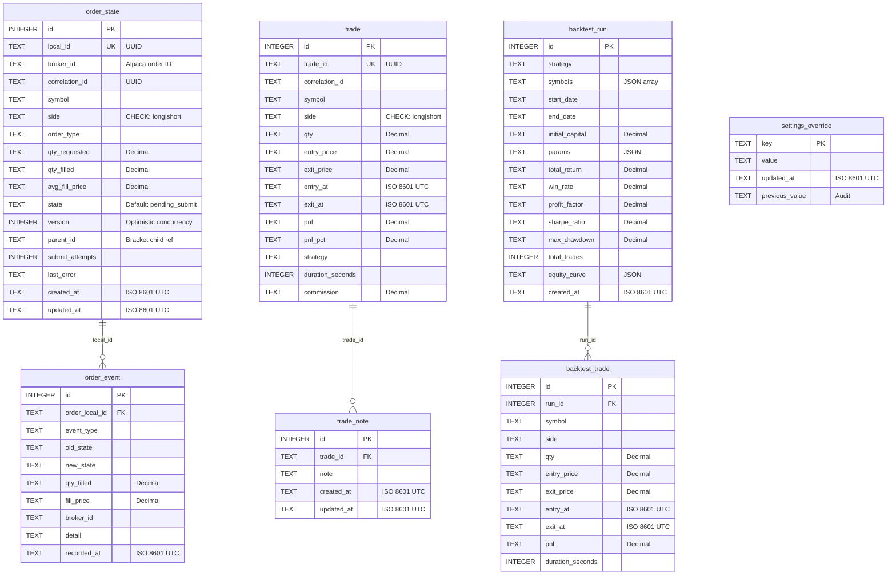

# Step 1: Foundation - Project Scaffolding, Config, Database, Logging, Calendar, CLI

## Overview

Build the foundational layer for the algo-trader Phase 1 trading engine. This step creates the project structure, configuration system, database schemas, structured logging, market calendar integration, and CLI skeleton. No trading logic - just the infrastructure everything else builds on.

## Problem Statement

The algo-trader repository currently contains only documentation (CLAUDE.md, brainstorm, Phase 1 plan, README). There is no Python code, no project configuration, no database, and no tooling. Every subsequent step (broker integration, strategy engine, order management, backtesting, web UI) depends on this foundation being correct and well-tested.

## Design Decisions (Gap Resolution)

These decisions resolve gaps identified during SpecFlow analysis of the Phase 1 plan.

### D1: Config Tier 4 (settings_override) Merge Strategy
**Decision**: Build the full 4-tier config mechanism in Step 1. `AppConfig` loads tiers 1-3 at instantiation. A separate `get_effective_value(key)` function queries `settings_override` at call time for UI-editable keys only. For Step 1, the table is always empty - the mechanism is tested but unused until Step 7 (Web UI).

### D2: PRAGMA foreign_keys = ON
**Decision**: Yes. Add `PRAGMA foreign_keys = ON` to the SQLite connection event listener alongside WAL mode and busy_timeout. The `trade_note` and `backtest_trade` foreign keys would be silently ignored without this.

### D3: Missing no_delete_trade Trigger
**Decision**: Add it. The Phase 1 plan has `no_update_trade` but no `no_delete_trade` - this is an oversight. The `trade` table should match `order_event` (both no_update and no_delete).

### D4: Alembic + Immutability Triggers
**Decision**: Include triggers in the initial Alembic migration via `op.execute()`. Create a helper function `create_immutability_triggers()` that can be called from any migration. Document in a comment that batch-mode migrations on trigger-protected tables will destroy triggers and they must be re-created.

### D5: Env Var Naming Convention
**Decision**: Use `env_nested_delimiter="__"` consistently. Remove explicit `alias=` on BrokerConfig fields. All env vars follow the pattern: `ALGO_BROKER__API_KEY`, `ALGO_BROKER__SECRET_KEY`, `ALGO_RISK__MAX_DAILY_LOSS_PCT`, etc. Document in `.env.example`.

### D6: Async vs Sync SQLAlchemy
**Decision**: Use `create_async_engine` with `aiosqlite` as the primary engine for the application. Use a separate sync engine for Alembic migrations. CLI commands that need DB access use `asyncio.run()` to bootstrap a minimal async context. This matches the Phase 1 plan's asyncio architecture.

### D7: CLI Error Handling (stop/status when engine not running)
**Decision**: Catch `ConnectionRefusedError`/`httpx.ConnectError` and print: "Engine is not running (could not connect to localhost:{port})." Exit code 1.

### D8: Development vs Production Logging
**Decision**: Add `log_format: str = "console"` to `AppConfig` with values `"console"` (pretty-print, default) and `"json"`. Console is the default for local development. JSON for Docker/production.

### D9: SQLite busy_timeout
**Decision**: 5000ms (5 seconds). Add `db_busy_timeout_ms: int = 5000` to `AppConfig`.

### D10: Timestamp Format
**Decision**: `YYYY-MM-DDTHH:MM:SS.ffffffZ` (microsecond precision, Z suffix, always UTC). Create a helper `utc_now() -> datetime` in `utils/time.py` that returns timezone-aware UTC datetime and `format_timestamp(dt) -> str` for consistent formatting.

### D11: Decimal-as-TEXT TypeDecorator
**Decision**: Implement a custom SQLAlchemy `TypeDecorator` called `DecimalText` in `models/base.py` that converts between Python `Decimal` and SQLite `TEXT`. This ensures all monetary values are automatically converted without manual handling.

### D12: VelezConfig.candle_interval_minutes Validator
**Decision**: Add `@field_validator("candle_interval_minutes")` that restricts to `{1, 2, 5, 10}`.

### D13: Log Level Validator
**Decision**: Add `@field_validator("log_level")` that restricts to `{"DEBUG", "INFO", "WARNING", "ERROR", "CRITICAL"}`.

### D14: Data Directory Auto-Creation
**Decision**: On startup, if the parent directory of `db_path` does not exist, create it. Add `data/` to `.gitignore`.

### D15: Backtest CLI in Step 1
**Decision**: Create the Click command with expected arguments (`--strategy`, `--symbols`, `--start-date`, `--end-date`, `--initial-capital`) and a body that prints "Backtest engine not yet implemented (Step 6)" and exits 0.

### D16: Market Calendar Interface
**Decision**: Expose `market_open(date)`, `market_close(date)`, `is_market_open(datetime)`, `is_trading_day(date)`, `is_half_day(date)`, `next_market_open(datetime)`. Regular session only. Pre-market/after-hours added in Phase 2.

### D17: Alembic Downgrade Strategy
**Decision**: Raise `NotImplementedError` in `downgrade()`. This is a trading system handling real money - schema rollbacks are dangerous. Backup-and-restore is the rollback strategy.

### D18: Config Source Annotation (algo-trader config)
**Decision**: For Step 1, output a table showing each config key, its resolved value, and its source (default/env/envfile). Settings_override source added in Step 7. Use `rich` or plain text table format.

---

## Technical Approach

### Architecture

```
backend/
├── app/
│   ├── __init__.py
│   ├── main.py                  # Entry point placeholder (Step 2+)
│   ├── config.py                # Pydantic Settings (4-tier hierarchy)
│   ├── models/
│   │   ├── __init__.py
│   │   ├── base.py              # DeclarativeBase, async engine, WAL pragmas, DecimalText
│   │   ├── order.py             # OrderState, OrderEvent, Trade, TradeNote
│   │   └── backtest.py          # BacktestRun, BacktestTrade, SettingsOverride
│   ├── cli/
│   │   ├── __init__.py
│   │   └── commands.py          # Click CLI: start, stop, status, backtest, config
│   └── utils/
│       ├── __init__.py
│       ├── logging.py           # structlog setup, correlation IDs
│       └── time.py              # UTC helpers, market calendar wrapper
├── alembic/
│   ├── env.py                   # render_as_batch=True, async support
│   ├── alembic.ini
│   └── versions/
│       └── 001_initial_schema.py
├── tests/
│   ├── conftest.py              # Shared fixtures (tmp db, config)
│   ├── unit/
│   │   ├── test_config.py
│   │   ├── test_models.py
│   │   ├── test_logging.py
│   │   ├── test_time.py
│   │   └── test_cli.py
│   └── integration/
│       └── test_migrations.py
├── pyproject.toml
├── mypy.ini
└── .env.example
```

### Dependencies

**Runtime:**
```
alpaca-py >= 0.43
fastapi >= 0.115
uvicorn[standard]
sqlalchemy[asyncio] >= 2.0.38
aiosqlite
alembic
pandas >= 2.0
pandas-ta >= 0.3
numpy
pydantic-settings >= 2.0
exchange-calendars >= 4.12
apscheduler >= 3.11, < 4.0
structlog
click
httpx
```

**Dev/Test:**
```
pytest
pytest-asyncio
hypothesis
mypy
ruff
```

Note: `httpx` added for CLI `stop`/`status` commands (HTTP client for communicating with running engine).

---

## Implementation Phases

All phases follow TDD: write failing test first, then minimal code to pass, then refactor. Each phase ends with `uv run pytest` and `uv run mypy backend/app` passing.

### Phase 1A: Project Scaffolding (~15 min)

**Goal**: Working Python project with uv, ruff, mypy, pytest all configured and passing on an empty project.

**Tasks:**
- [ ] Install `uv` if not present
- [ ] Run `uv init` in `backend/`
- [ ] Configure `pyproject.toml`:
  - Python 3.11+ requirement
  - All runtime dependencies
  - All dev dependencies
  - Ruff config (line-length=88, double quotes, isort sections)
  - Pytest config (asyncio_mode="auto", testpaths)
  - Click entry point: `[project.scripts] algo-trader = "app.cli.commands:cli"`
- [ ] Create `backend/mypy.ini` with `strict = true`
- [ ] Create `backend/.env.example` with all env vars documented
- [ ] Create root `.gitattributes` for LF line endings
- [ ] Create root `.dockerignore` (placeholder for Step 8)
- [ ] Add `data/` to root `.gitignore`
- [ ] Create directory structure with `__init__.py` files
- [ ] Verify: `uv run pytest` passes (no tests yet = passes), `uv run ruff check .`, `uv run mypy backend/app`

**Files created:**
- `backend/pyproject.toml`
- `backend/mypy.ini`
- `backend/.env.example`
- `backend/app/__init__.py`
- `backend/app/main.py` (empty placeholder)
- `backend/app/config.py` (empty placeholder)
- `backend/app/models/__init__.py`
- `backend/app/models/base.py` (empty placeholder)
- `backend/app/models/order.py` (empty placeholder)
- `backend/app/models/backtest.py` (empty placeholder)
- `backend/app/cli/__init__.py`
- `backend/app/cli/commands.py` (empty placeholder)
- `backend/app/utils/__init__.py`
- `backend/app/utils/logging.py` (empty placeholder)
- `backend/app/utils/time.py` (empty placeholder)
- `backend/tests/__init__.py`
- `backend/tests/conftest.py`
- `backend/tests/unit/__init__.py`
- `backend/tests/integration/__init__.py`
- `.gitattributes`
- `.dockerignore`

### Phase 1B: Configuration System (~30 min)

**Goal**: Full Pydantic Settings config with validation, env var loading, and 4-tier hierarchy.

**Test first** (`backend/tests/unit/test_config.py`):
```python
# Tests to write FIRST:
# 1. test_default_config_loads - AppConfig() with no env vars produces valid defaults
# 2. test_risk_bounds_validation - max_risk_per_trade_pct=0.1 raises ValidationError
# 3. test_risk_bounds_lower - max_risk_per_trade_pct=0.0001 raises ValidationError
# 4. test_watchlist_validation - invalid symbol "aapl" or "TOOLONG" raises error
# 5. test_empty_watchlist_rejected - empty list raises error
# 6. test_candle_interval_validation - interval=3 raises error, interval=2 passes
# 7. test_log_level_validation - log_level="TRACE" raises error
# 8. test_env_var_override - ALGO_RISK__MAX_DAILY_LOSS_PCT=0.05 overrides default
# 9. test_nested_env_var - ALGO_BROKER__PAPER=false overrides default
# 10. test_config_hierarchy_priority - env var beats .env file value
# 11. test_broker_paper_default_true - BrokerConfig().paper is True
# 12. test_decimal_fields_are_decimal - all monetary config values are Decimal type
```

**Then implement** (`backend/app/config.py`):
- `BrokerConfig(BaseSettings)` - provider, paper, feed, api_key, secret_key
- `RiskConfig(BaseSettings)` - all risk params with bounds validators
- `VelezConfig(BaseSettings)` - strategy params with candle_interval validator
- `WebConfig(BaseSettings)` - host, port
- `AppConfig(BaseSettings)` - top-level with nested configs, log_level validator, watchlist validator
- `model_config` with `env_prefix="ALGO_"`, `env_nested_delimiter="__"`
- Add `log_format: str` and `db_busy_timeout_ms: int` fields per design decisions

### Phase 1C: Database Models + DecimalText (~45 min)

**Goal**: SQLAlchemy models for all 7 tables, DecimalText TypeDecorator, async engine with WAL/foreign_keys/busy_timeout pragmas.

**Test first** (`backend/tests/unit/test_models.py`):
```python
# Tests to write FIRST (using in-memory SQLite):
# 1. test_create_all_tables - all 7 tables created successfully
# 2. test_decimal_text_round_trip - write Decimal("123.456") -> read back Decimal("123.456")
# 3. test_decimal_text_precision - Decimal("0.01") stores and retrieves exactly
# 4. test_order_state_side_check - side="invalid" violates CHECK constraint
# 5. test_order_event_immutable_update - UPDATE on order_event raises
# 6. test_order_event_immutable_delete - DELETE on order_event raises
# 7. test_trade_immutable_update - UPDATE on trade raises
# 8. test_trade_immutable_delete - DELETE on trade raises (new trigger from D3)
# 9. test_order_state_local_id_unique - duplicate local_id raises IntegrityError
# 10. test_foreign_key_enforcement - trade_note with invalid trade_id raises
# 11. test_wal_mode_enabled - PRAGMA journal_mode returns 'wal'
# 12. test_foreign_keys_enabled - PRAGMA foreign_keys returns 1
# 13. test_order_state_version_default - new row has version=0
# 14. test_settings_override_upsert - insert then update same key works
```

**Then implement:**

`backend/app/models/base.py`:
```python
# - DeclarativeBase subclass
# - DecimalText(TypeDecorator) - impl_type=String, process_bind_param -> str, process_result_value -> Decimal
# - create_async_engine() helper with db_path param
# - @event.listens_for(engine.sync_engine, "connect") handler:
#     PRAGMA journal_mode=WAL
#     PRAGMA busy_timeout={ms}
#     PRAGMA foreign_keys=ON
```

`backend/app/models/order.py`:
- `OrderStateModel` - maps to `order_state` table (all columns per Phase 1 plan)
- `OrderEventModel` - maps to `order_event` table
- `TradeModel` - maps to `trade` table
- `TradeNoteModel` - maps to `trade_note` table

`backend/app/models/backtest.py`:
- `BacktestRunModel` - maps to `backtest_run` table
- `BacktestTradeModel` - maps to `backtest_trade` table
- `SettingsOverrideModel` - maps to `settings_override` table

### Phase 1D: Alembic Migrations (~20 min)

**Goal**: Alembic configured for async SQLAlchemy + SQLite batch mode. Initial migration creates all tables with indexes, constraints, and immutability triggers.

**Test first** (`backend/tests/integration/test_migrations.py`):
```python
# Tests to write FIRST:
# 1. test_upgrade_from_empty - alembic upgrade head on empty DB succeeds
# 2. test_all_tables_exist - after upgrade, all 7 tables present
# 3. test_all_indexes_exist - spot-check key indexes
# 4. test_immutability_triggers_exist - query sqlite_master for trigger names
# 5. test_downgrade_raises - alembic downgrade raises NotImplementedError
```

**Then implement:**
- `backend/alembic.ini` - SQLite connection string, script_location
- `backend/alembic/env.py` - `render_as_batch=True`, import models, target_metadata
- `backend/alembic/versions/001_initial_schema.py`:
  - All table creates via autogenerate
  - `op.execute()` for immutability triggers (including `no_delete_trade`)
  - Helper function `create_immutability_triggers()` for reuse
  - `downgrade()` raises `NotImplementedError`
  - Comment documenting trigger + batch migration risk

### Phase 1E: Structured Logging (~20 min)

**Goal**: structlog configured with JSON and console renderers, correlation ID via contextvars.

**Test first** (`backend/tests/unit/test_logging.py`):
```python
# Tests to write FIRST:
# 1. test_json_format_output - log entry is valid JSON with expected keys
# 2. test_console_format_output - log entry is human-readable (not JSON)
# 3. test_correlation_id_included - set correlation_id, verify it appears in log
# 4. test_correlation_id_cleared - correlation_id does not leak between contexts
# 5. test_log_level_filtering - DEBUG message not shown when level=INFO
# 6. test_timestamp_in_log - every log entry has ISO 8601 timestamp
# 7. test_setup_logging_returns_logger - setup_logging() returns a bound logger
```

**Then implement** (`backend/app/utils/logging.py`):
```python
# - correlation_id: ContextVar[str] with default ""
# - set_correlation_id(cid: str) -> None
# - get_correlation_id() -> str
# - setup_logging(level: str, format: str) -> None
#     Configures structlog with:
#       - add_log_level processor
#       - TimeStamper(fmt="iso", utc=True)
#       - correlation_id injection processor
#       - JSONRenderer (format="json") or ConsoleRenderer (format="console")
# - get_logger(name: str) -> structlog.BoundLogger
```

### Phase 1F: Market Calendar (~20 min)

**Goal**: Market calendar wrapper with NYSE hours, half-day detection, DST-safe UTC conversion.

**Test first** (`backend/tests/unit/test_time.py`):
```python
# Tests to write FIRST:
# 1. test_utc_now_is_utc - utc_now() returns timezone-aware UTC datetime
# 2. test_format_timestamp - format_timestamp produces "...Z" suffix
# 3. test_parse_timestamp_roundtrip - format then parse returns equal datetime
# 4. test_regular_trading_day - 2026-02-13 (Friday) is a trading day
# 5. test_weekend_not_trading_day - 2026-02-14 (Saturday) is not
# 6. test_holiday_not_trading_day - 2026-01-01 (New Year's) is not
# 7. test_market_open_time - regular day opens at 14:30 UTC (9:30 ET)
# 8. test_market_close_time - regular day closes at 21:00 UTC (4:00 PM ET)
# 9. test_half_day_close_early - day after Thanksgiving closes at 18:00 UTC (1:00 PM ET)
# 10. test_is_market_open_during_hours - 2026-02-13 15:00 UTC returns True
# 11. test_is_market_open_after_hours - 2026-02-13 22:00 UTC returns False
# 12. test_next_market_open_from_weekend - from Saturday returns Monday 14:30 UTC
# 13. test_dst_transition - verify correct times around March DST change
```

**Then implement** (`backend/app/utils/time.py`):
```python
# - NYSE_CALENDAR_NAME = "XNYS"
# - _calendar: lazy-loaded exchange_calendars instance (module-level singleton)
# - utc_now() -> datetime
# - format_timestamp(dt: datetime) -> str
# - parse_timestamp(s: str) -> datetime
# - market_open(date: date) -> datetime  (UTC)
# - market_close(date: date) -> datetime  (UTC)
# - is_market_open(dt: datetime) -> bool
# - is_trading_day(d: date) -> bool
# - is_half_day(d: date) -> bool
# - next_market_open(dt: datetime) -> datetime  (UTC)
```

### Phase 1G: CLI Skeleton (~25 min)

**Goal**: Click CLI with all 5 commands. `start` is a placeholder. `stop`/`status` make HTTP calls with error handling. `backtest` is a placeholder. `config` dumps resolved config.

**Test first** (`backend/tests/unit/test_cli.py`):
```python
# Tests to write FIRST (using Click's CliRunner):
# 1. test_cli_help - `algo-trader --help` shows all commands
# 2. test_start_command_exists - `algo-trader start --help` works
# 3. test_stop_engine_not_running - `algo-trader stop` when no engine prints friendly error
# 4. test_status_engine_not_running - `algo-trader status` when no engine prints friendly error
# 5. test_backtest_not_implemented - `algo-trader backtest` prints not-yet-implemented message
# 6. test_config_shows_defaults - `algo-trader config` shows resolved config values
# 7. test_config_shows_env_override - with ALGO_LOG_LEVEL=DEBUG, config shows DEBUG
# 8. test_backtest_arguments - `algo-trader backtest --help` shows expected args
```

**Then implement** (`backend/app/cli/commands.py`):
```python
# @click.group()
# def cli(): ...
#
# @cli.command()
# def start():
#     """Start the trading engine and web server."""
#     click.echo("Trading engine not yet implemented (Step 2+)")
#
# @cli.command()
# def stop():
#     """Graceful shutdown of the running engine."""
#     # httpx.post(f"http://{host}:{port}/api/shutdown")
#     # Handle ConnectionRefusedError -> friendly message
#
# @cli.command()
# def status():
#     """Show current positions, P&L, and engine state."""
#     # httpx.get(f"http://{host}:{port}/api/dashboard")
#     # Handle ConnectionRefusedError -> friendly message
#
# @cli.command()
# @click.option("--strategy", required=True)
# @click.option("--symbols", required=True)
# @click.option("--start-date", required=True)
# @click.option("--end-date", required=True)
# @click.option("--initial-capital", default="25000")
# def backtest(**kwargs):
#     """Run a backtest against historical data."""
#     click.echo("Backtest engine not yet implemented (Step 6)")
#
# @cli.command("config")
# def show_config():
#     """Dump resolved configuration with source of each value."""
#     # Load AppConfig, print as table
```

### Phase 1H: Integration Verification (~10 min)

**Goal**: All tests pass, mypy passes, ruff passes, Alembic migration runs on fresh DB.

**Tasks:**
- [ ] `uv run pytest` - all unit + integration tests pass
- [ ] `uv run mypy backend/app` - zero errors
- [ ] `uv run ruff check backend/` - zero errors
- [ ] `uv run ruff format --check backend/` - no formatting issues
- [ ] `uv run alembic upgrade head` - creates DB with all tables
- [ ] `uv run algo-trader --help` - shows all commands
- [ ] `uv run algo-trader config` - shows resolved config
- [ ] Manual verification: DB file created in `data/`, WAL mode confirmed

---

## Acceptance Criteria

### Functional
- [ ] `uv run pytest` passes all tests (unit + integration)
- [ ] `uv run mypy backend/app --strict` passes with zero errors
- [ ] `uv run ruff check backend/` and `uv run ruff format --check backend/` pass
- [ ] `AppConfig()` loads valid defaults with no env vars set
- [ ] Env var `ALGO_RISK__MAX_DAILY_LOSS_PCT=0.05` overrides default
- [ ] `RiskConfig(max_risk_per_trade_pct=Decimal("0.1"))` raises `ValidationError`
- [ ] `VelezConfig(candle_interval_minutes=3)` raises `ValidationError`
- [ ] `AppConfig(log_level="TRACE")` raises `ValidationError`
- [ ] `AppConfig(watchlist=["aapl"])` raises `ValidationError` (lowercase)
- [ ] All 7 database tables created via `alembic upgrade head`
- [ ] `DecimalText` round-trips `Decimal("123.456789")` exactly
- [ ] UPDATE/DELETE on `order_event` and `trade` tables raises SQLite error
- [ ] `PRAGMA foreign_keys` returns 1 on new connections
- [ ] `PRAGMA journal_mode` returns `wal` on new connections
- [ ] structlog produces valid JSON when `log_format="json"`
- [ ] Correlation ID appears in log output when set
- [ ] `is_trading_day("2026-02-14")` returns False (Saturday)
- [ ] `market_close()` returns correct UTC time for half-days
- [ ] `algo-trader --help` lists all 5 commands
- [ ] `algo-trader stop` prints friendly error when engine not running
- [ ] `algo-trader config` prints resolved config with defaults

### Non-Functional
- [ ] All monetary config values are `Decimal` type (never `float`)
- [ ] No hardcoded secrets in codebase
- [ ] `.env.example` documents every required env var
- [ ] `data/` is in `.gitignore`
- [ ] All timestamps use UTC with microsecond precision

### Quality Gates
- [ ] All tests written BEFORE implementation (TDD)
- [ ] Zero mypy errors in strict mode
- [ ] Zero ruff lint/format errors
- [ ] No `Optional[X]` - use `X | None` throughout
- [ ] No bare `except:` - specific exceptions only
- [ ] Google-style docstrings on all public classes and non-obvious functions
- [ ] No magic numbers - named constants for all thresholds

---

## ERD (Database Schema)



**Immutability triggers** (fire BEFORE UPDATE/DELETE, raise ABORT):
- `order_event`: `no_update_order_event`, `no_delete_order_event`
- `trade`: `no_update_trade`, `no_delete_trade`

---

## Risk Analysis

| Risk | Likelihood | Impact | Mitigation |
|------|-----------|--------|------------|
| Pydantic Settings v2 nested model env var behavior differs from expected | Medium | Medium | Write tests for every env var pattern before implementing config |
| exchange-calendars DST handling edge cases | Low | High | Test with specific DST transition dates (March, November) |
| SQLAlchemy async + SQLite pragma race condition | Low | Medium | Set pragmas in connection event listener (fires per connection) |
| Alembic batch mode destroys triggers on future migrations | Medium | Critical | Document risk, create reusable trigger helper, test trigger existence |
| aiosqlite version incompatibility with SQLAlchemy | Low | Medium | Pin compatible versions, test DB operations in integration tests |

---

## References

### Internal
- Phase 1 Plan: `docs/plans/2026-02-13-feat-phase-1-trading-engine-plan.md`
- Brainstorm: `docs/brainstorms/2026-02-13-algo-trader-brainstorm.md`
- Engineering Standards: `CLAUDE.md`

### External
- [uv documentation](https://docs.astral.sh/uv/)
- [Pydantic Settings v2](https://docs.pydantic.dev/latest/concepts/pydantic_settings/)
- [SQLAlchemy async](https://docs.sqlalchemy.org/en/20/orm/extensions/asyncio.html)
- [structlog](https://www.structlog.org/)
- [exchange-calendars](https://github.com/gerrymanoim/exchange_calendars)
- [Click](https://click.palletsprojects.com/)
- [Alembic batch migrations](https://alembic.sqlalchemy.org/en/latest/batch.html)
